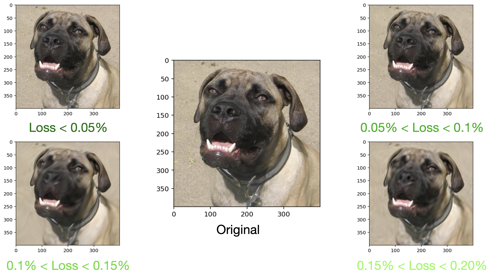

# Abstract

A generative model models the generation of data in the real world. It explains how data is created in terms of a probabilistic model. Image editing, visual domain adaptation, data augmentation for discriminative models, and assisted creative production are all examples of generative models.

To be specific, datasets often have fewer data points in some sections of their domain, which might reduce model performance if not handled appropriately. Generative models may be used to modify datasets and upsample low-density areas. This is particularly beneficial for skewed datasets and simulated data settings.

In addition to that, in a wide range of mathematics and engineering areas, high-dimensional probability distributions are crucial elements. As in many domains, such as visual data, most distribution content is constrained to a small region of space, we can safely compress it to a space with a lower dimension. A great test of our capacity to represent and work with high-dimensional probability distributions is the training and sampling of generative models that use the same approach.

In this work, we are trying to propose a new network in order to explicitly incorporate the frequency representation in the process of image generation to create a stable novel image generative model. The backbone of our model is a composition of low-frequency low-dimensional structures, designed to store high-dimensional images in a low-dimensional space in the frequency domain.

If all images in a dataset could be assigned to separate points in our proposed latent space, we could get new samples from this space to generate fake images. We have two main contributions in this thesis:

- Introducing a unique Fourier-based algorithm for the lossy image compression task with an adjustable compression rate.
- Proposing a novel image generative model that relies on the same idea behind the compression task.

# Image Compression

In the first step, we will show that it is possible to compress images in a network that
consists of a composition of many low-frequency sine and cosine functions in a relatively
low dimensional space. This network is trained on just one image. It treats each image as
a 2-dimensional function. It gets the position of each pixel of an image and outputs the
corresponding pixel value — either a scalar for a black-and-white image or an RGB value
for a colour image. After the training process is done, the weights of the network are a
compressed copy of the input image, which means that instead of the image itself, we can
save the network and use it to reconstruct the image. Also, not that reconstruction is fast
and can be done in parallel for each pixel. To reconstruct the image, we give the position of
each pixel as input of the model and output is the value of that pixel.

# Results

