# Abstract

A generative model models the generation of data in the real world. It explains how data is created in terms of a probabilistic model. Image editing, visual domain adaptation, data augmentation for discriminative models, and assisted creative production are all examples of generative models.

To be specific, datasets often have fewer data points in some sections of their domain, which might reduce model performance if not handled appropriately. Generative models may be used to modify datasets and upsample low-density areas. This is particularly beneficial for skewed datasets and simulated data settings.

In addition to that, in a wide range of mathematics and engineering areas, high-dimensional probability distributions are crucial elements. As in many domains, such as visual data, most distribution content is constrained to a small region of space, we can safely compress it to a space with a lower dimension. A great test of our capacity to represent and work with high-dimensional probability distributions is the training and sampling of generative models that use the same approach.

In this work, we are trying to propose a new network in order to explicitly incorporate the frequency representation in the process of image generation to create a stable novel image generative model. The backbone of our model is a composition of low-frequency low-dimensional structures, designed to store high-dimensional images in a low-dimensional space in the frequency domain.

If all images in a dataset could be assigned to separate points in our proposed latent space, we could get new samples from this space to generate fake images. We have two main contributions in this thesis:

- Introducing a unique Fourier-based algorithm for the lossy image compression task with an adjustable compression rate.
- Proposing a novel image generative model that relies on the same idea behind the compression task.

# Image Compression

In the first step, we will show that it is possible to compress images in a network that
consists of a composition of many low-frequency sine and cosine functions in a relatively
low dimensional space. This network is trained on just one image. It treats each image as
a 2-dimensional function. It gets the position of each pixel of an image and outputs the
corresponding pixel value — either a scalar for a black-and-white image or an RGB value
for a colour image.

After the training process is done, the weights of the network are a
compressed copy of the input image, which means that instead of the image itself, we can
save the network and use it to reconstruct the image. Also, not that reconstruction is fast
and can be done in parallel for each pixel. To reconstruct the image, we give the position of
each pixel as input of the model and output is the value of that pixel. Following is the equation
of i_th layer in this network.

We also use MSE loss to compare output of our model to the original image.

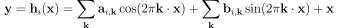

where <b>k</b> &isin; {0,1}m. The dimension of the layer, which we will alternately
refer to as its width, is denoted by m.

# Results

  <figcaption>  Comparison between our model and JPEG algorithm on ImageNet dataset. The width and depth of
our model in this experiment are 8 and 6 respectively. A lossy JPEG algorithm with almost
the same compression rate has been used to compress the original image.</figcaption>

# Image generation

After we found out that it is possible to reduce the dimension of images with this network
without losing much quality, we tried to use it in an image generation model. Note that 
the main idea of many image generation models is to compress high-dimensional images into 
low-dimensional spaces.

In our generation model, we try to further explore the lower-dimensional 
structure in natural images. We use another deep neural network as a decoder to generate
all the above Fourier coefficients, i.e., <b>ak</b>'s and <b>bk</b>’s, from 
an even smaller set of parameters in a low-dimensional latent space. 
Different images that have different embeddings will have different decoder outputs, 
which would lead to different reconstructed images. If the latent space is regulated enough, 
any point there could potentially be mapped to a realistic image, and after the model is trained, 
we can use any point in the low-dimensional latent space to generate a new image in the original high-dimensional space.

We also add the log-likelihood of each latent representation coming from 
a Gaussian distribution time by a constant—which is a hyperparameter—to the MSE loss function 
to make the latent space normal.

In the training process, we found out that large networks are unstable to train. Our
solution to this problem was to add an encoder before the latent representation. Instead of
randomly initializing z, we pass each image to an encoder then we use the output as the
latent representation of the image. Using this structure, not only large networks are stabilized
but also similar images have similar latent representations even at the beginning of training,
which speeds up the training process. Similar to the decoder, we employed an MLP as the encoder 
in our model. We only utilize an encoder when training on the CIFAR-10 dataset, whereas we do not 
employ an encoder for the MNIST dataset.

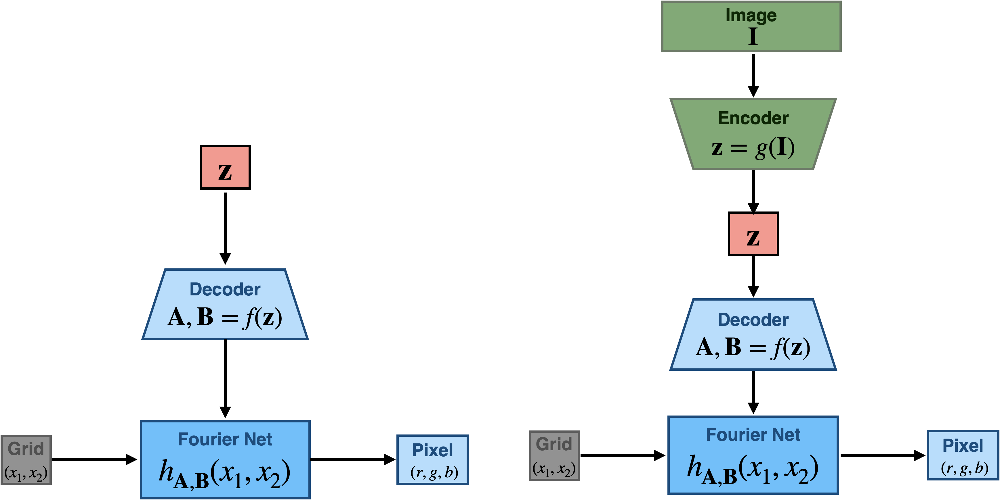
  <figcaption> Our Model without (left image) and with (right image) an encoder.
    <b>z</b> is the latent representation of each image, <b>A</b> and  <b>B</b> are the set of all
    <b>ak</b>'s and <b>bk</b>’s of each image, (x1, x2)
    is the input position of each pixel, and (r, g, b) is output of network for each pixel of each image.</figcaption>

# Results

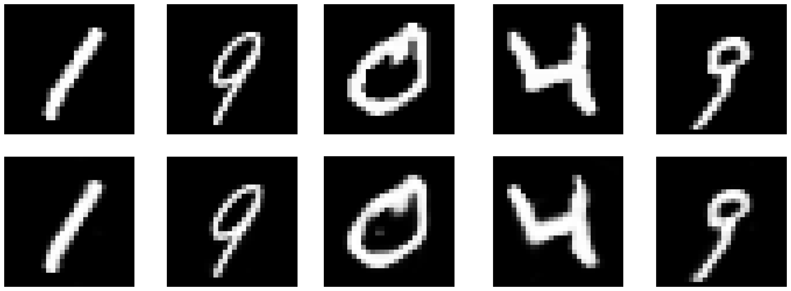

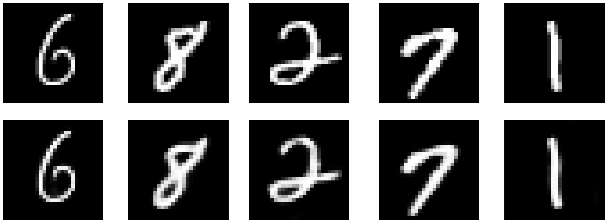
  <figcaption> Original images and their reconstructed version using the our model trained on
all MNIST dataset. We can see that images has been embedded in the latent space almost
prefectly which means that square loss of the training is close to zero - excluding log-likelihood
part.</figcaption>

  

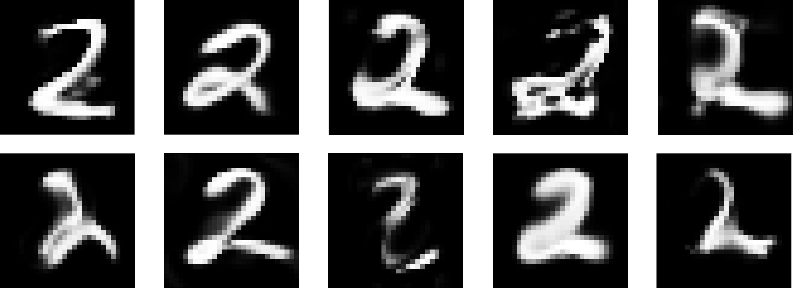

  <figcaption> Random images generated using our model trained on (a) number 2 and (b)
number 7 images of that dataset.</figcaption>

  

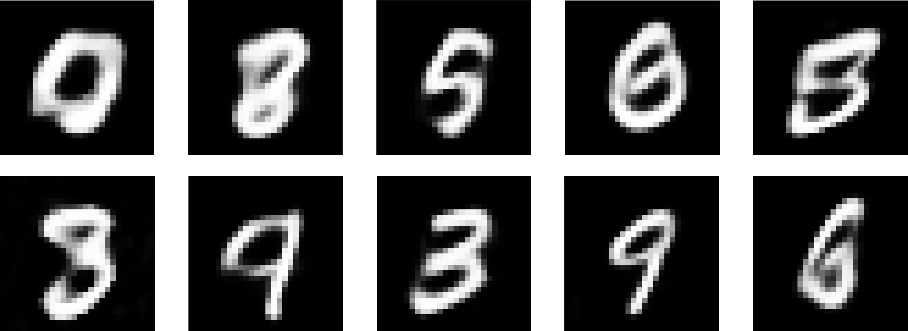

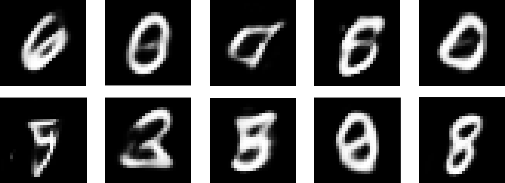
  <figcaption> Random images sampled from our model trained on full MNIST dataset.</figcaption>

  

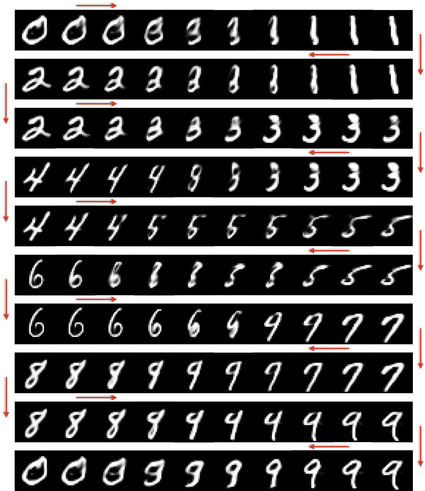
  <figcaption> nterpolation between different integers from 0 to 9. We start from one image
latent representation and as we go toward the next one in the latent space, we feed that to
the decoder and get the output from Fourier Net.</figcaption>

  

  <figcaption> Random images sampled from our model trained on full MNIST dataset.</figcaption>

  

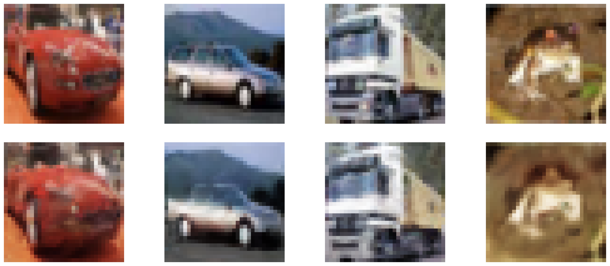

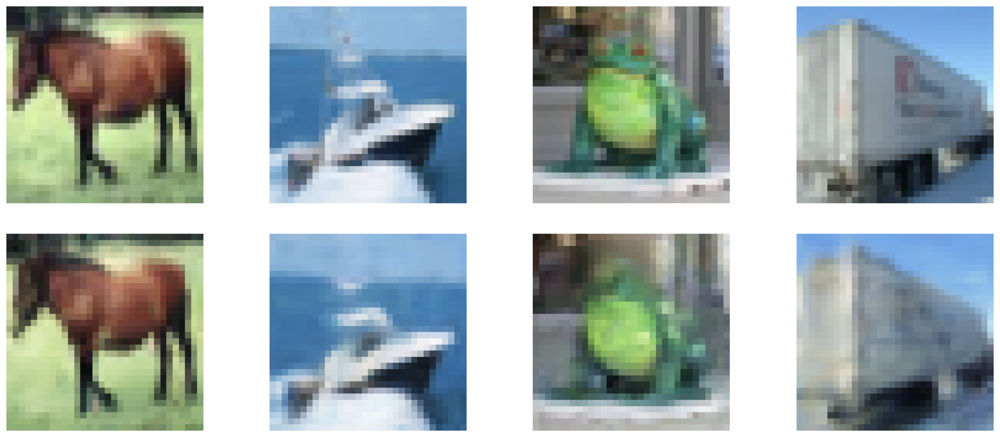
  <figcaption> Original images and their reconstructed version using the our model trained on
CIFAR10 dataset. Images have been embedded in the latent space with a small quality loss.</figcaption>

  

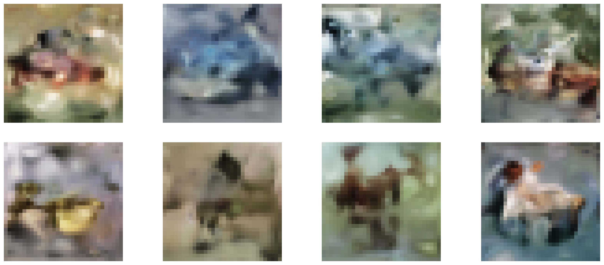

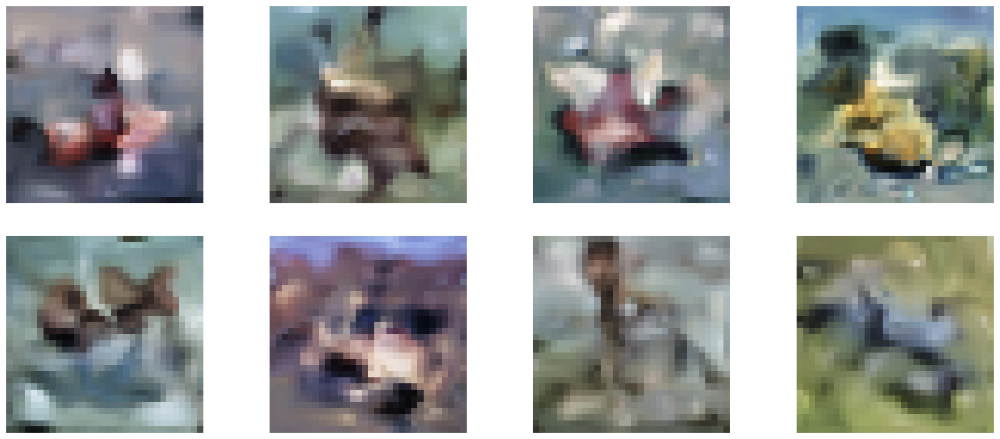
  <figcaption> Random images sampled from our model trained on CIFAR10 dataset.</figcaption>

    

<table>
  <tr>
    <th><b>Model</b></th>
    <th><b>FID</b></th> 
  </tr>
  <tr>
    <td>VAE</td>
    <td>106.0</td> 
  </tr>
  <tr>
    <td>WAE</td>
    <td>80.9</td> 
  </tr>
  <tr>
    <td>DCGAN (convolutional based)</td>
    <td>30.9</td> 
  </tr>
  <tr>
    <td>Fourier Net (ours)</td>
    <td>80.5</td> 
  </tr>
</table>

FID comparison between different models trained on CIFAR10 dataset

